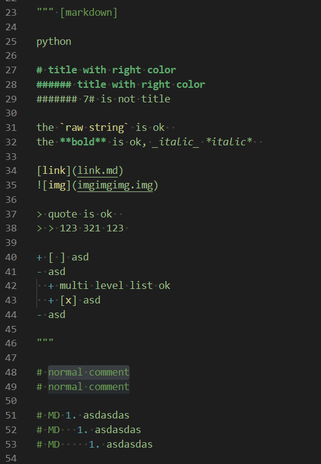
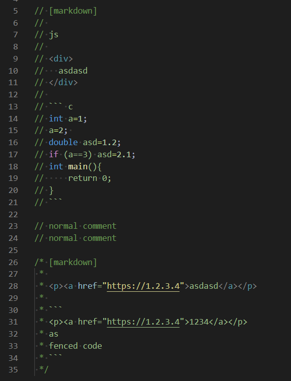
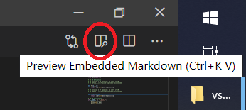
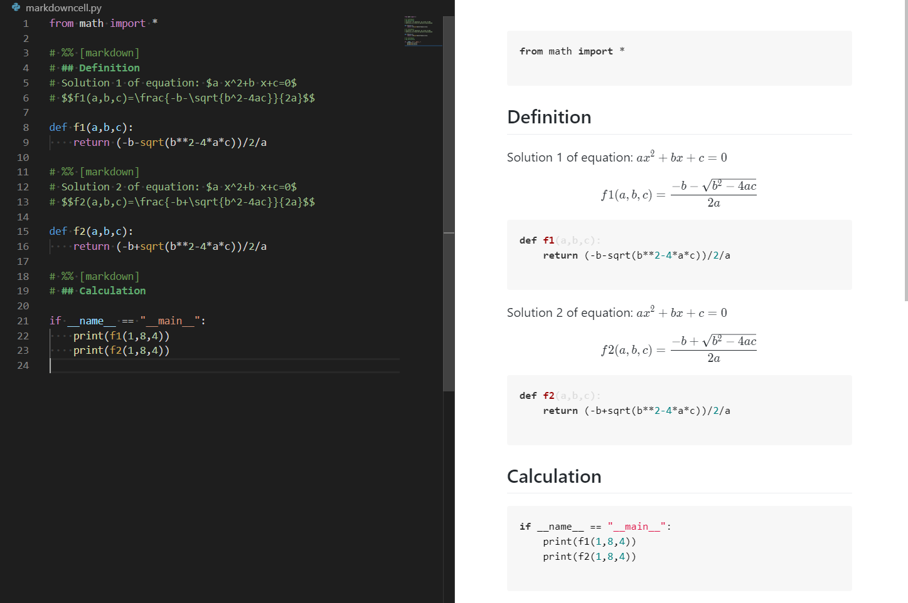
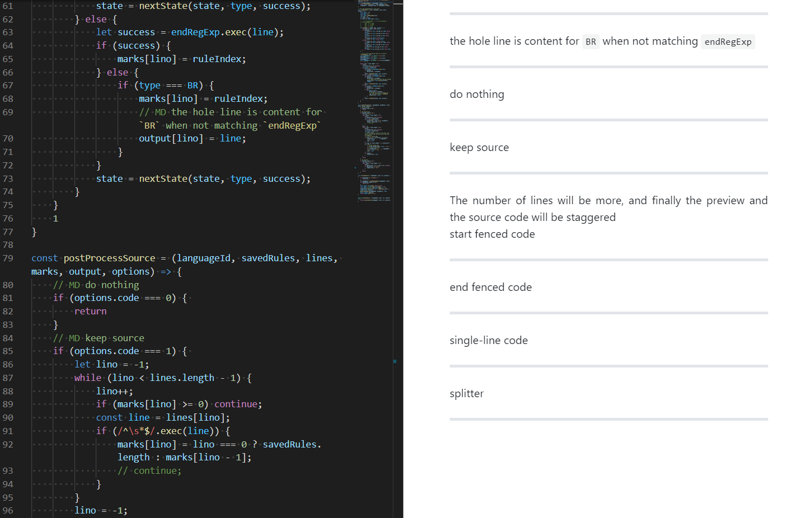
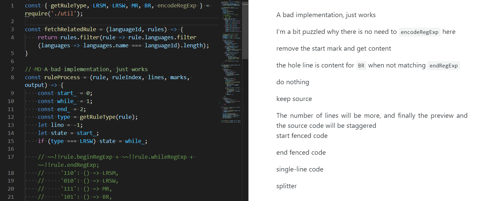
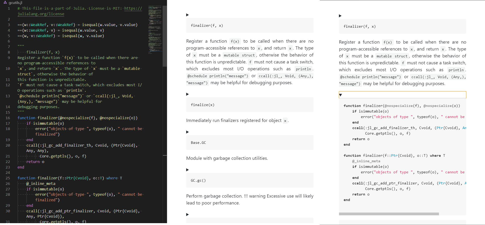
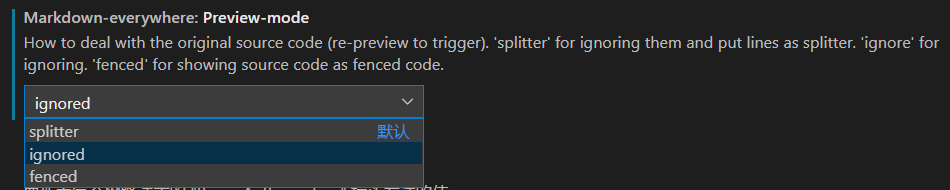
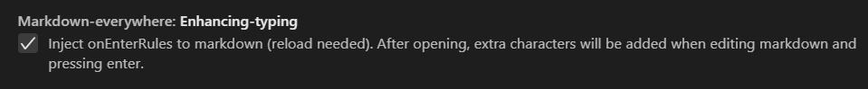

# Markdown Everywhere

Embed and highlight and **preview** markdown in any language which support line-comment or block-comment for vscode.

e.g. Highlight python markdown cell/ Highlight julia markdown doc string

`Embed & Highlight`  
  


`preview`  
  



## Preview

Four mode  
+ `splitter`: ignore source code part and put `<hr>` as splitter  
+ `ignored`: ignore source code part  
+ `fenced`: keep source code as fenced code  
+ `folded`: keep source code as folded fenced code  

`splitter` Help organize information  

`ignored`  

`fenced`  

`folded`  


change it at "settings.json"  


## Extract Markdown

Command "Extract as Markdown to Clipboard" (also in right-mouse-click context menu.)

Convert selection into Markdown format according to the rules and preview mode, place it into the clipboard.

Can be used to copy Markdown from formats similar to JSDoc, automatically ignoring the `*` at the beginning of each line.

## Enhancing-typing

`whileSymbol` or `whileRegExp` (if `whileSymbol` undefined) will be used for enhancing typing.  
There will be some `onEnterRules` pushed to markdown.  
So it will also affect the editing of normal markdown files.  
You can turn off it in "settings.json".

`onEnterRules` checks the previous line, so it does not work on the first line of a markdown region.

Example:
```js
// MD the first line
// MD the second line
```
After pressing `enter` at `"e"`, it will automatically append `"// MD "`.
```js
// MD the first line
// MD the second line
// MD 
```
change it at "settings.json"  



## Recommended Color

You can put those into "settings.json" to adjust the color.  
So that markdown can be easily distinguished from both code and comments.  

```json
"editor.tokenColorCustomizations": {
    "[Default Dark+]": {
        "textMateRules": [
            {
                "scope": "meta.embedded.block.everywhere.md markup.heading, meta.embedded.block.everywhere.md markup.bold",
                "settings": {
                    "foreground": "#61aa71",
                }
            },
            {
                "scope": "meta.embedded.block.everywhere.md punctuation.definition.list.begin.markdown, meta.embedded.block.everywhere.md entity.name.tag",
                "settings": {
                    "foreground": "#599aa5",
                }
            },
            {
                "scope": "meta.embedded.block.everywhere.md entity.other.attribute-name",
                "settings": {
                    "foreground": "#98bdc4",
                }
            },
            {
                "scope": "meta.embedded.block.everywhere.md markup.inline.raw, meta.embedded.block.everywhere.md string",
                "settings": {
                    "foreground": "#ceca8b",
                }
            },
            {
                "scope": "meta.embedded.block.everywhere.md, meta.embedded.block.everywhere.md meta.embedded",
                "settings": {
                    "foreground": "#9abb87",
                }
            }
        ]
    }
}
```

## Supported List

(note that some languages require that you install an VS Code extension that provides a grammar for that language)

<!--Supported_List_Splitter-->

| Rule | Type | Example | Languages |
|--|--|--|--|
| number-sign-MD | LRSW | # MD # title<br># MD content<br> | coffeescript<br>dockerfile<br>git-commit<br>git-rebase<br>diff<br>ignore<br>properties<br>makefile<br>perl<br>perl6<br>powershell<br>python<br>r<br>ruby<br>shellscript<br>yaml<br>cython<br>julia<br>cmake |
| number-sign | LRSM | # [markdown]<br># # title<br># content<br> | coffeescript<br>dockerfile<br>git-commit<br>git-rebase<br>diff<br>ignore<br>properties<br>makefile<br>perl<br>perl6<br>powershell<br>python<br>r<br>ruby<br>shellscript<br>yaml<br>cython<br>julia<br>cmake |
| slash-star | MR | /* [markdown]<br>&nbsp;* # title<br>&nbsp;* content<br>&nbsp;*/<br> | c<br>cpp<br>csharp<br>css<br>go<br>groovy<br>hlsl<br>java<br>javascriptreact<br>javascript<br>json<br>jsonc<br>less<br>objective-c<br>objective-cpp<br>php<br>rust<br>scss<br>shaderlab<br>sql<br>swift<br>typescript<br>typescriptreact<br>antlr |
| double-slash-MD | LRSW | // MD # title<br>// MD content<br> | c<br>cpp<br>csharp<br>fsharp<br>go<br>groovy<br>hlsl<br>java<br>javascriptreact<br>javascript<br>json<br>jsonc<br>less<br>objective-c<br>objective-cpp<br>php<br>rust<br>scss<br>shaderlab<br>swift<br>typescript<br>typescriptreact<br>antlr<br>qasm-lang |
| double-slash | LRSM | // [markdown]<br>// # title<br>// content<br> | c<br>cpp<br>csharp<br>fsharp<br>go<br>groovy<br>hlsl<br>java<br>javascriptreact<br>javascript<br>json<br>jsonc<br>less<br>objective-c<br>objective-cpp<br>php<br>rust<br>scss<br>shaderlab<br>swift<br>typescript<br>typescriptreact<br>antlr<br>qasm-lang |
| percentage-MD | LRSW | % MD # title<br>% MD content<br> | matlab<br>bibtex<br>tex<br>latex |
| percentage | LRSM | % [markdown]<br>% # title<br>% content<br> | matlab<br>bibtex<br>tex<br>latex |
| number-sign-double-percentage | LRSM | # %% [markdown]<br># # highlight python markdown cell<br># for the vscode-python data-science feature<br> | coffeescript<br>dockerfile<br>git-commit<br>git-rebase<br>diff<br>ignore<br>properties<br>makefile<br>perl<br>perl6<br>powershell<br>python<br>r<br>ruby<br>shellscript<br>yaml<br>cython<br>julia<br>cmake |
| triple-quote | BR | """<br>&nbsp;&nbsp;&nbsp;&nbsp;bar(x[, y])<br><br>julia standard markdown doc<br>"""<br>function bar(x, y) ... | julia<br>python |
| whitespace-triple-quote | MR | def abc():<br>&nbsp;&nbsp;&nbsp;&nbsp;"""<br>&nbsp;&nbsp;&nbsp;&nbsp;xxx xxx<br>&nbsp;&nbsp;&nbsp;&nbsp;xxx xxx<br>&nbsp;&nbsp;&nbsp;&nbsp;"""<br>&nbsp;&nbsp;&nbsp;&nbsp;... | julia<br>python |
| brace-dash | BR | {- [markdown]<br># title<br>content-}<br> | haskell<br>purescript |
| double-dash-MD | LRSW | -- MD # title<br>-- MD content<br> | haskell<br>purescript |
| double-dash | LRSM | -- [markdown]<br>-- # title<br>% content<br> | haskell<br>purescript |

<!--Supported_List_Splitter-->

## Customize

Imitate [rules](https://github.com/zhaouv/vscode-markdown-everywhere/blob/master/build/rules.js) and add new rules to "settings.json". And then run command "Build Markdown Embedding Rules" and then reload (press "F1", type "Build Markdown Embedding Rules" and "Reload Window"). And you need to run build command again when you update this extension.

Save the first element `defaultRules` to keep default rules. Remove to only use customized rules. Example:

``` json
"markdown-everywhere.customized-rules": [
    "defaultRules",
    {
        "name": "number-sign-equals",
        "beginRegExp": "#=\\s*\\[markdown\\]",
        "endRegExp": "=#",
        "example": "#= [markdown]<br># title<br>content<br>=#",
        "languages": [
            { "name": "julia", "source": "source.julia" }
        ]
    }
]
```

<!-- File changed dynamically. Not working when debugging, But effective after actual installation. -->

## Rules

There are 4 types of rules, corresponding to 4 implementations

**LRSW**  
line rule starts with the mark  
`whileRegExp`
```js
// MD connecting line-comment
// MD each line starts with the mark
```
```js
rule={
    name: "double-slash-MD",
    whileRegExp: "// MD",
    example: "// MD # title<br>// MD content<br>",
    languages: [
        ...languages.filter(l => l.comments.lineComment === "//"),
        { name: "antlr", source: "source.antlr" },
        { name: "qasm-lang", source: "source.qasm" },
    ]
}
```

**BR**  
block rule  
`beginRegExp`+`endRegExp`  
> May introduce incorrect rendering, for example, use `"""` as markdown content in the follow demo
```python
""" [markdown]
block comment starts with a start mark
and finally a end mark
"""
```
```js
rule={
    name: "triple-quote",
    beginRegExp: "\"\"\"\\s*\\[markdown\\]",
    endRegExp: "\"\"\"",
    example: "\"\"\" [markdown]<br># title<br>content<br>\"\"\"",
    languages: [
        ...languages.filter(l => JSON.stringify(l.comments.blockComment||"") === JSON.stringify(["\"\"\"", "\"\"\""])),
    ]
}
```

> preview will break in a situation like this, the current preview does not parse the statements
> ```python
> a="""
> asd
> """
> ```
> you can custom rules without defaultRules to close the triple-quote rule

**MR**  
mixed rule  
`beginRegExp`+`whileRegExp`+`endRegExp`  
> May introduce incorrect rendering, for example, use `*/` as markdown content in the follow demo
```js
/* [markdown]
 * block comment starts with a start mark
 * and each line starts with the mark
 * and finally a end mark
 */
```
```js
rule={
    name: "slash-star",
    beginRegExp: "/\\*\\s*\\[markdown\\]",
    whileRegExp: "\\*(?!/)",
    whileSymbol: "*",
    endRegExp: "\\*/",
    example: "/* [markdown]<br>&nbsp;* # title<br>&nbsp;* content<br>&nbsp;*/<br>",
    languages: [
        ...languages.filter(l => JSON.stringify(l.comments.blockComment||"") === JSON.stringify(["/*","*/"])),
        { name: "antlr", source: "source.antlr" },
    ]
}
```

**LRSM**  
line rule with a start mark  
`beginRegExp`+`whileRegExp`

```js
// [markdown]
// some connecting normal line-comment 
// starts with a start mark (which is normaly a line-comment)
```
```js
rule={
    name: "double-slash",
    beginRegExp: "//\\s*\\[markdown\\]",
    whileRegExp: "//",
    example: "// [markdown]<br>// # title<br>// content<br>",
    languages: [
        ...languages.filter(l => l.comments.lineComment === "//"),
        { name: "antlr", source: "source.antlr" },
        { name: "qasm-lang", source: "source.qasm" },
    ]
}
```

> There is bug for this case. The following first line will be highlighted as comment. I haven't figured out the mechanism yet. So please put a empty line after these.

* * * * *

Extending from my pr in [vscode-python](https://github.com/microsoft/vscode-python) ([issue](https://github.com/microsoft/vscode-python/issues/4356)/[pr](https://github.com/microsoft/vscode-python/pull/13359)).
