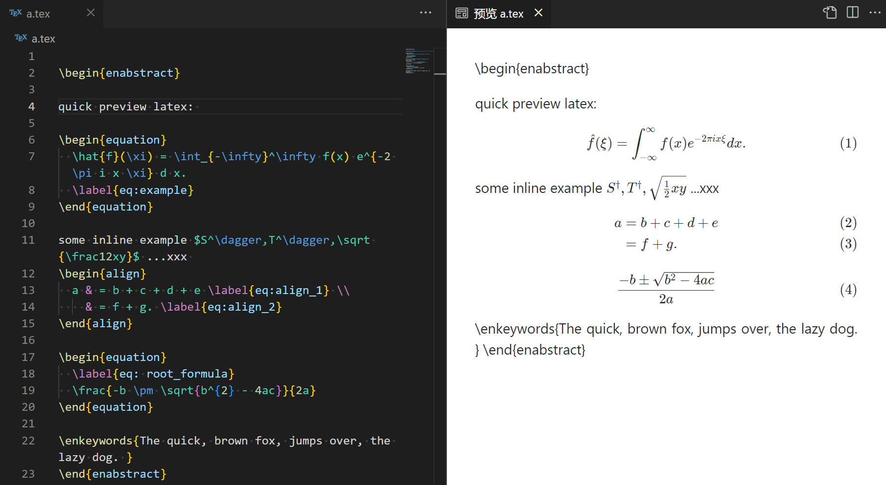

# Markdown Everywhere

Embed, highlight and *preview* markdown in any language which supports line-comment or block-comment for vscode. It is also used for interpreting text as Markdown.

As an example, quickly preview LaTeX/ Highlight Python Markdown cell/ Highlight Julia Markdown doc string.

#### Embed & Highlight

 

#### Preview

  

## Preview

Five modes are available:

+ `splitter`: Ignores the source code part, and uses `<hr>` as a splitter.
+ `ignored`: Ignores the source code part.
+ `fenced`: Retains the source code as fenced code.
+ `folded`: Retains the source code as folded fenced code.
+ `raw`: Does nothing (exists for when working with `preview-inject`).

#### `splitter`

Helps to organize information:


#### `ignored`


#### `fenced`


#### `folded`


#### `raw`


Change it at:

1.  `settings.json`, then
1.  `preview-mode`


<!-- Using `preview-mode-language` could setting for respective languages. -->

Provides a setting to open preview automatically for listed languages.

## Preview Inject

<!-- Does some actions in parsing, only support to do some replacing before parse Markdown to HTML now. -->

<!-- `settings.json` for quickly previewing LaTeX. -->

```JSONC
    "markdown-everywhere.preview-mode-language": {"latex":"raw"},
    "markdown-everywhere.preview-mode-inject": [
        {"language":"latex","path":".*","beforeSource":" let {src,options}=args\n const lines = src.split(/\\r?\\n|\\r\\n?/);\n let lino = -1;\n let currentOffset = 0;\n \n while (++lino < lines.length) {\n let pa=null;\n let line = lines[lino];\n\n // MD remove `\\label`, do not change number of lines, directly replace\n line=line.replace(/\\\\label{.*?}/g,'')\n\n // MD fix equation, add 3 more lines. fix offset for trace\n pa=/\\\\begin{(equation|display|alignat|aligned|align|multline|flalign)}/\n if (pa.exec(line)){\n line=line.replace(pa,(m)=>'\\n\\n$$\\n'+m)\n currentOffset+=3\n options.offset.push([lino + currentOffset, currentOffset])\n }\n\n // MD fix equation\n pa=/\\\\end{(equation|display|alignat|aligned|align|multline|flalign)}/\n if (pa.exec(line)){\n line=line.replace(pa,(m)=>m+'\\n$$\\n\\n')\n currentOffset+=3\n options.offset.push([lino + currentOffset, currentOffset])\n }\n\n lines[lino] = line;\n }\n return lines.join('\\r\\n');\n \n "}
    ],
```

<!-- > The JSON is generated from issue. More applications may be listed in the issue. -->

## Extract Markdown

This extension provides a command labelled "Extract as Markdown to Clipboard" (which is also in right-mouse-click context menu). It converts the selection into Markdown format according to the rules and preview mode, and places it into the clipboard. It can be used to copy Markdown from formats similar to JSDoc, automatically ignoring the `*` at the beginning of each line.

## Enhancing-typing

`whileSymbol` or `whileRegExp` (if `whileSymbol` undefined) will be used to enhance typing. There will be some `onEnterRules` pushed to Markdown. Consequently, it shall also affect the editing of normal markdown files. It can be disabled in `settings.json`. <!-- Where? -->

`onEnterRules` checks the previous line, so it does not work on the first line of a markdown region.

#### Example

```JS
// MD the first line
// MD the second line
```

After pressing `enter` at `"e"`, it will automatically append `"// MD "`.

```JS
// MD the first line
// MD the second line
// MD 
```

It can be enabled or disabled in `settings.json`: <!-- Where? -->


## Recommended Color

You can put those into `settings.json` to adjust the color so that Markdown can be easily distinguished from both code and comments.

```JSONC
"editor.tokenColorCustomizations": {
    "[Default Dark+]": {
        "textMateRules": [
            {
                "scope": "meta.embedded.block.everywhere.md markup.heading, meta.embedded.block.everywhere.md markup.bold",
                "settings": {
                    "foreground": "#61aa71",
                }
            },
            {
                "scope": "meta.embedded.block.everywhere.md punctuation.definition.list.begin.markdown, meta.embedded.block.everywhere.md entity.name.tag",
                "settings": {
                    "foreground": "#599aa5",
                }
            },
            {
                "scope": "meta.embedded.block.everywhere.md entity.other.attribute-name",
                "settings": {
                    "foreground": "#98bdc4",
                }
            },
            {
                "scope": "meta.embedded.block.everywhere.md markup.inline.raw, meta.embedded.block.everywhere.md string",
                "settings": {
                    "foreground": "#ceca8b",
                }
            },
            {
                "scope": "meta.embedded.block.everywhere.md, meta.embedded.block.everywhere.md meta.embedded",
                "settings": {
                    "foreground": "#9abb87",
                }
            }
        ]
    }
}
```

## Supported List

Note that some languages require that you install a VS Code extension that provides grammar for that language.

<!--Supported_List_Splitter-->

| **Rule**                        | **Type** | **Example**                                                                                                                                                                   | **Languages**                                                                                                                                                                                                                                              |
|---------------------------------|----------|-------------------------------------------------------------------------------------------------------------------------------------------------------------------------------|------------------------------------------------------------------------------------------------------------------------------------------------------------------------------------------------------------------------------------------------------------|
| `number-sign-MD`                | LRSW     | <pre><code># MD # title<br># MD content<br></code></pre>                                                                                                                                              | <ul><li>coffeescript</li><li>dockerfile</li><li>git-commit</li><li>git-rebase</li><li>diff</li><li>ignore</li><li>properties</li><li>makefile</li><li>perl</li><li>perl6</li><li>powershell</li><li>python</li><li>r</li><li>ruby</li><li>shellscript</li><li>yaml</li><li>cython</li><li>julia</li><li>cmake</li></ul>                                                |
| `number-sign`                   | LRSM     | <pre><code># [markdown]<br># # title<br># content<br></code></pre>                                                                                                                                    | <ul><li>coffeescript</li><li>dockerfile</li><li>git-commit</li><li>git-rebase</li><li>diff</li><li>ignore</li><li>properties</li><li>makefile</li><li>perl</li><li>perl6</li><li>powershell</li><li>python</li><li>r</li><li>ruby</li><li>shellscript</li><li>yaml</li><li>cython</li><li>julia</li><li>cmake</li></ul>                                                |
| `slash-star`                    | MR       | <pre><code>/* [markdown]<br>&nbsp;* # title<br>&nbsp;* content<br>&nbsp;*/<br></code></pre>                                                                                                           | <ul><li>c</li><li>cpp</li><li>csharp</li><li>css</li><li>go</li><li>groovy</li><li>hlsl</li><li>java</li><li>javascriptreact</li><li>javascript</li><li>json</li><li>jsonc</li><li>less</li><li>objective-c</li><li>objective-cpp</li><li>php</li><li>rust</li><li>scss</li><li>shaderlab</li><li>sql</li><li>swift</li><li>typescript</li><li>typescriptreact</li><li>antlr</li></ul>          |
| `double-slash-MD`               | LRSW     | <pre><code>// MD # title<br>// MD content<br></code></pre>                                                                                                                                            | <ul><li>c</li><li>cpp</li><li>csharp</li><li>fsharp</li><li>go</li><li>groovy</li><li>hlsl</li><li>java</li><li>javascriptreact</li><li>javascript</li><li>json</li><li>jsonc</li><li>less</li><li>objective-c</li><li>objective-cpp</li><li>php</li><li>rust</li><li>scss</li><li>shaderlab</li><li>swift</li><li>typescript</li><li>typescriptreact</li><li>antlr</li><li>qasm-lang</li></ul> |
| `double-slash`                  | LRSM     | <pre><code>// [markdown]<br>// # title<br>// content<br></code></pre>                                                                                                                                 | <ul><li>c</li><li>cpp</li><li>csharp</li><li>fsharp</li><li>go</li><li>groovy</li><li>hlsl</li><li>java</li><li>javascriptreact</li><li>javascript</li><li>json</li><li>jsonc</li><li>less</li><li>objective-c</li><li>objective-cpp</li><li>php</li><li>rust</li><li>scss</li><li>shaderlab</li><li>swift</li><li>typescript</li><li>typescriptreact</li><li>antlr</li><li>qasm-lang</li></ul> |
| `percentage-MD`                 | LRSW     | <pre><code>% MD # title<br>% MD content<br></code></pre>                                                                                                                                              | <ul><li>matlab</li><li>bibtex</li><li>tex</li><li>latex</li></ul>                                                                                                                                                                                                                           |
| `percentage`                    | LRSM     | <pre><code>% [markdown]<br>% # title<br>% content<br></code></pre>                                                                                                                                    | <ul><li>matlab</li><li>bibtex</li><li>tex</li><li>latex</li></ul>                                                                                                                                                                                                                           |
| `number-sign-double-percentage` | LRSM     | <pre><code># %% [markdown]<br># # highlight python markdown cell<br># for the vscode-python data-science feature<br></code></pre>                                                                     | <ul><li>coffeescript</li><li>dockerfile</li><li>git-commit</li><li>git-rebase</li><li>diff</li><li>ignore</li><li>properties</li><li>makefile</li><li>perl</li><li>perl6</li><li>powershell</li><li>python</li><li>r</li><li>ruby</li><li>shellscript</li><li>yaml</li><li>cython</li><li>julia</li><li>cmake</li></ul>                                                |
| `triple-quote`                  | BR       | <pre><code>"""<br>&nbsp;&nbsp;&nbsp;&nbsp;bar(x[, y])<br><br>julia standard markdown doc<br>"""<br>function bar(x, y) ...</code></pre>                                                                | <ul><li>julia</li><li>python</li></ul>                                                                                                                                                                                                                                            |
| `whitespace-triple-quote`       | MR       | <pre><code>def abc():<br>&nbsp;&nbsp;&nbsp;&nbsp;"""<br>&nbsp;&nbsp;&nbsp;&nbsp;xxx xxx<br>&nbsp;&nbsp;&nbsp;&nbsp;xxx xxx<br>&nbsp;&nbsp;&nbsp;&nbsp;"""<br>&nbsp;&nbsp;&nbsp;&nbsp;... | <ul><li>julia</li><li>python</li></ul>                                                                                                                                                                                                                                            |
| `brace-dash`                    | BR       | <pre><code>{- [markdown]<br># title<br>content-}<br></code></pre>                                                                                                                                     | <ul><li>haskell</li><li>purescript</li></ul>                                                                                                                                                                                                                                      |
| `double-dash-MD`                | LRSW     | <pre><code>-- MD # title<br>-- MD content<br></code></pre>                                                                                                                                            | <ul><li>haskell</li><li>purescript</li></ul>                                                                                                                                                                                                                                      |
| `double-dash`                   | LRSM     | <pre><code>-- [markdown]<br>-- # title<br>% content<br></code></pre>                                                                                                                                  | <ul><li>haskell</li><li>purescript</li></ul>                                                                                                                                                                                                                                      |
| `double-slash-exclamation`      | LRSW     | <pre><code>//! # title<br>//! content<br></code></pre>                                                                                                                                                | rust                                                                                                                                                                                                                                                       |
| `triple-slash`                  | LRSW     | <pre><code>/// # title<br>/// content<br></code></pre>                                                                                                                                                | rust                                                                                                                                                                                                                                                       |
| `slash-start-exclamation`       | BR       | <pre><code>/*! <br># My Crate<br>*/<br></code></pre>                                                                                                                                                  | rust                                                                                                                                                                                                                                                       |

<!--Supported_List_Splitter-->

## Customize

Imitate [rules](https://github.com/zhaouv/vscode-markdown-everywhere/blob/master/build/rules.js) and add new rules to `settings.json`. Then, run the command labelled "Build Markdown Embedding Rules" and reload (press <kbd>F1</kbd>, then type "Build Markdown Embedding Rules" and "Reload Window"). Lastly, you need to run the build command again when you update this extension.

Save the first element `defaultRules` to keep default rules. Remove to only use customized rules. Example:

```JSONC
"markdown-everywhere.customized-rules": [
    "defaultRules",
    {
        "name": "number-sign-equals",
        "beginRegExp": "#=\\s*\\[markdown\\]",
        "endRegExp": "=#",
        "example": "#= [markdown]<br># title<br>content<br>=#",
        "languages": [
            { "name": "julia", "source": "source.julia" }
        ]
    }
]
```

<!-- File changed dynamically. Not working when debugging, But effective after actual installation. -->

## Rules

There are 4 types of rules, corresponding to 4 implementations

#### LRSW

The line rule starts with the mark "`whileRegExp`".

```JS
// MD connecting line-comment
// MD each line starts with the mark
```

```JS
rule={
    name: "double-slash-MD",
    whileRegExp: "// MD",
    example: "// MD # title<br>// MD content<br>",
    languages: [
        ...languages.filter(l => l.comments.lineComment === "//"),
        { name: "antlr", source: "source.antlr" },
        { name: "qasm-lang", source: "source.qasm" },
    ]
}
```

#### BR

The block rule "`beginRegExp`+`endRegExp`" may introduce incorrect rendering. As an example, use `"""` as Markdown content in the undermentioned demonstration:

```py
""" [markdown]
block comment starts with a start mark
and finally a end mark
"""
```

```JS
rule={
    name: "triple-quote",
    beginRegExp: "\"\"\"\\s*\\[markdown\\]",
    endRegExp: "\"\"\"",
    example: "\"\"\" [markdown]<br># title<br>content<br>\"\"\"",
    languages: [
        ...languages.filter(l => JSON.stringify(l.comments.blockComment||"") === JSON.stringify(["\"\"\"", "\"\"\""])),
    ]
}
```

The preview shall break in a situation like this. The current preview does not parse the statements:

```py
a="""
asd
"""
```

You can customise rules without `defaultRules`, to close the triple-quote rule.

#### MR

The mixed rule "`beginRegExp`+`whileRegExp`+`endRegExp`" may introduce incorrect rendering. As an example, use `*/` as markdown content in the undermentioned demonstration:

```JS
/* [markdown]
 * block comment starts with a start mark
 * and each line starts with the mark
 * and finally a end mark
 */
```

```JS
rule={
    name: "slash-star",
    beginRegExp: "/\\*\\s*\\[markdown\\]",
    whileRegExp: "\\*(?!/)",
    whileSymbol: "*",
    endRegExp: "\\*/",
    example: "/* [markdown]<br>&nbsp;* # title<br>&nbsp;* content<br>&nbsp;*/<br>",
    languages: [
        ...languages.filter(l => JSON.stringify(l.comments.blockComment||"") === JSON.stringify(["/*","*/"])),
        { name: "antlr", source: "source.antlr" },
    ]
}
```

#### LRSM

The line rule with the start mark of "`beginRegExp`+`whileRegExp`":

```JS
// [markdown]
// some connecting normal line-comment 
// starts with a start mark (which is normaly a line-comment)
```

```JS
rule={
    name: "double-slash",
    beginRegExp: "//\\s*\\[markdown\\]",
    whileRegExp: "//",
    example: "// [markdown]<br>// # title<br>// content<br>",
    languages: [
        ...languages.filter(l => l.comments.lineComment === "//"),
        { name: "antlr", source: "source.antlr" },
        { name: "qasm-lang", source: "source.qasm" },
    ]
}
```

There is bug for this case. The following first line will be highlighted as comment. Unfortunately, I haven't ascertained what the mechanism is yet. Place an empty line after these.

---

Extending from my PR in [`vscode-python`](https://github.com/microsoft/vscode-python): ([issue](https://github.com/microsoft/vscode-python/issues/4356)/[PR](https://github.com/microsoft/vscode-python/pull/13359)).
